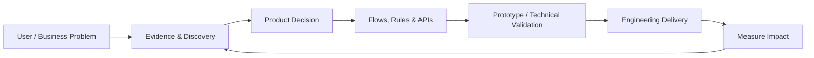

# Mohammad Javad Barati

### Product Manager who builds.

**I turn ambiguous product problems into validated decisions, working prototypes, APIs, and shipped systems.**

---

## Product impact

<table>
  <tr>
    <td align="center"><strong>3 months</strong> POS MVP shipped</td>
    <td align="center"><strong>300+</strong> vendor interviews</td>
    <td align="center"><strong>30+</strong> B2B APIs shipped</td>
  </tr>
  <tr>
    <td align="center"><strong>120B IRR</strong> loan issuance in 6 months</td>
    <td align="center"><strong>-30%</strong> CRM support tickets</td>
    <td align="center"><strong>+26%</strong> team velocity in 3 months</td>
  </tr>
</table>

I have worked across **restaurant POS/RMS, Open Banking, B2B platforms, workflow systems, marketplaces, and AI-enabled tools** — from discovery and product strategy to APIs, back-office flows, technical validation, and delivery.

> **My edge:** I do not build to replace engineers.
> I build enough to validate assumptions, understand technical constraints, debug real systems, prototype faster, and make better product decisions with engineering teams.

---

## From product problem to working system

My default loop is simple: **understand the problem → reduce uncertainty → build the smallest useful thing → measure what changed.**

---

## Selected builds

| Project                                                                                            | Problem I worked on                                                                                                   | What I built                                                                                                                                                                                             |
| -------------------------------------------------------------------------------------------------- | --------------------------------------------------------------------------------------------------------------------- | -------------------------------------------------------------------------------------------------------------------------------------------------------------------------------------------------------- |
| **[Azure DevOps RTL Fixer](https://github.com/mojabarati/azure-devops-rtl-Chrome-Extension)**      | Persian and Arabic work items are hard to read inside an LTR-first Azure DevOps interface.                            | A privacy-first Chrome Manifest V3 extension that detects meaningful RTL content, fixes alignment and BiDi presentation, supports dynamic SPA content, and includes automated validation/release checks. |
| **[DataGrip Codex ACP Windows Fix](https://github.com/mojabarati/datagrip-codex-acp-windows-fix)** | Integrated Codex in DataGrip could fail with a misleading “agent runtime may be corrupted” error on Windows.          | A reproducible PowerShell diagnostic, repair, verification, backup, and rollback toolkit built from root-cause analysis of the installation flow.                                                        |
| **[Classberri Backend](https://github.com/mojabarati/classberri-backend)**                         | Teachers and students need a structured platform for class publishing, profiles, authentication, and future bookings. | A TypeScript/Express/PostgreSQL backend with JWT + Google OAuth, role-based access, class lifecycle rules, Prisma, validation, Swagger/OpenAPI, and layered architecture.                                |
| **[GitHub README Fetcher](https://github.com/mojabarati/github-readme-fetcher)**                   | Fetching raw README content from arbitrary public GitHub repositories should be simple.                               | A small full-stack application with a Go backend and React frontend, including URL validation and error handling.                                                                                        |

<strong>Why I built the Azure DevOps RTL Fixer</strong>

 

This is the kind of problem I like: **small surface area, real workflow friction, clear user value**.

The product constraint was not simply “make text RTL.” Mixed Persian/Arabic and English technical language still needed to remain readable, Azure DevOps is dynamically rendered, and the extension should not change stored work-item data.

The solution therefore focuses on:

* local-only content detection;
* scoped presentation changes instead of rewriting text;
* mixed RTL/LTR readability;
* dynamic content handling;
* minimal browser permissions;
* testability and safe cleanup when disabled.

**Product lesson:** a narrow tool can still require strong problem framing, edge-case thinking, privacy decisions, and release discipline.

<strong>Why the DataGrip Codex fix matters</strong>

 

The visible error was only a symptom.

The useful work was tracing the installation lifecycle, separating runtime validation from package installation, identifying path/prefix and process-lock behavior, and turning a one-off workaround into a **repeatable diagnostic and repair flow**.

The repository includes:

* diagnostics before mutation;
* isolated repair;
* explicit verification;
* timestamped backups;
* rollback;
* documented limitations and alternative causes.

**Product lesson:** good troubleshooting is also product thinking — identify the real failure state, reduce risk, make recovery explicit, and design for users who are not experts.

<strong>Inside the Classberri product architecture</strong>

 

Classberri is where I practice translating product requirements into real system behavior.

Examples include:

* separate `TEACHER` and `STUDENT` roles;
* email/password and Google authentication;
* draft → published → closed class lifecycle;
* ownership and permission rules;
* public/private profile behavior;
* free/paid and online/in-person class models;
* pagination, filtering, validation, and error handling;
* API documentation with Swagger/OpenAPI.

**Product lesson:** writing a user story is easier when you understand what must happen across the frontend, API, business rules, authentication layer, and database.

---

## How I work as a PM

<table>
  <tr>
    <td width="33%" valign="top">
      <strong>01 — Find the real problem</strong>  
      User interviews, workflow observation, data, support signals, business constraints, and root-cause analysis.
    </td>
    <td width="33%" valign="top">
      <strong>02 — Reduce uncertainty</strong>  
      Prioritization, flows, business rules, prototypes, API thinking, SQL checks, and technical spikes when needed.
    </td>
    <td width="33%" valign="top">
      <strong>03 — Ship & measure</strong>  
      Clear scope, edge cases, engineering alignment, operational readiness, release discipline, and measurable outcomes.
    </td>
  </tr>
</table>

---

## Product + technical toolbox

**Product**

**Build & Data**

**Tools I use to think and communicate**

`Figma` · `Jira` · `Azure DevOps` · `BPMN` · `Swagger / OpenAPI` · `GitHub` · `AI-assisted prototyping`

---

## Career snapshots

**TapsiFood — Product Manager**
Built the company's first restaurant POS product from zero: **MVP in 3 months**, first market-fit version in 6 months, informed by **300+ vendor interviews** and competitor analysis.

**Tourism Bank — Product Manager**
Shipped **30+ B2B APIs**, helped establish a new Open Banking revenue stream, and supported **120B IRR in loan issuance within the first 6 months** of integrated lending capabilities.

**Chargoon — Product Manager**
Reduced CRM support tickets by **30%**, increased team velocity by **26% in 3 months**, and delivered prioritized features **25% ahead of schedule**.

---

## The products I enjoy most

I am most interested in product problems where **business logic and technical systems meet**:

`Marketplaces` · `AI products` · `B2B platforms` · `Payments` · `APIs` · `Back-office systems` · `Operational tooling`

Especially when the PM needs to understand not only **what users see**, but also what happens across **permissions, APIs, state transitions, data, integrations, failure cases, and operations**.

---

### Build to learn. Ship to measure.

If you are working on a product where strong product thinking needs to meet technical execution, feel free to reach out.

[**LinkedIn**](https://www.linkedin.com/in/mohammadjavadbarati/) · [**Email**](mailto:mojabarati@gmail.com) · [**GitHub**](https://github.com/mojabarati)

