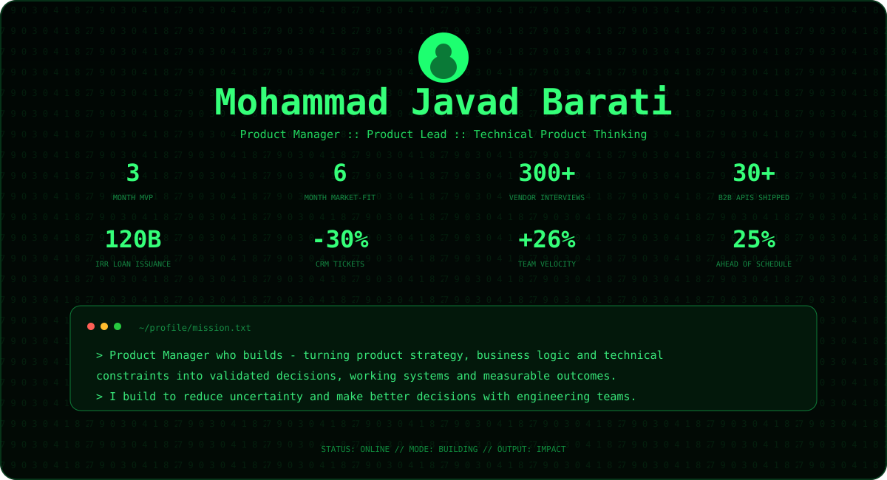
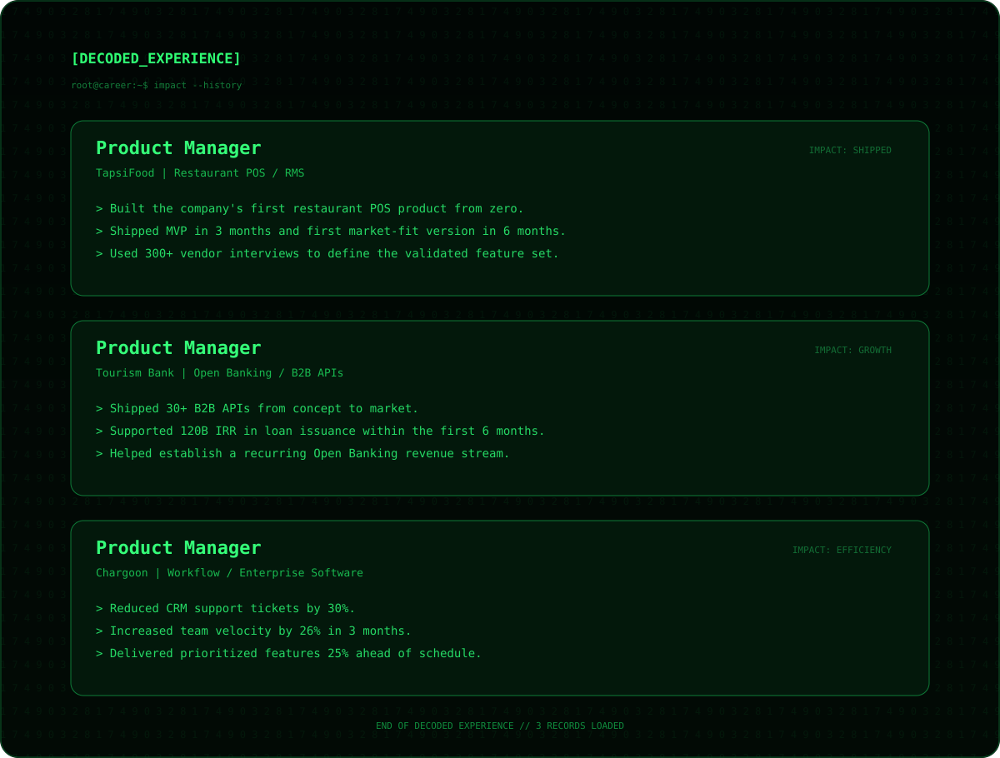
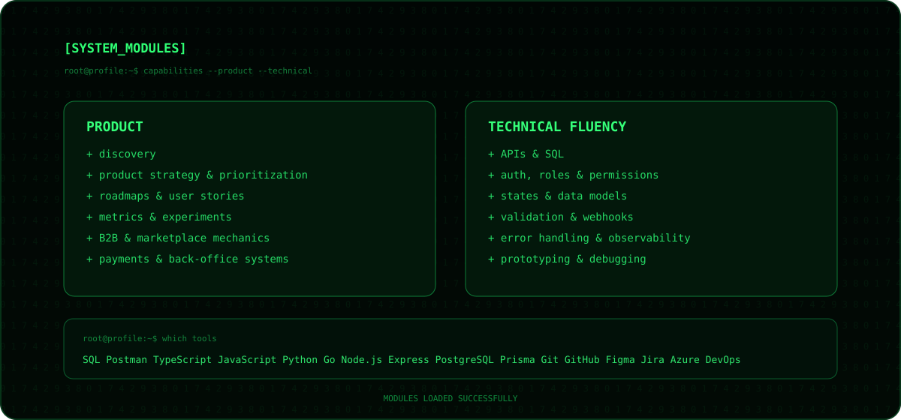

<div align="center">



<br/>

[](https://www.linkedin.com/in/mohammadjavadbarati/)
[](mailto:mojabarati@gmail.com)
[](https://github.com/mojabarati)

</div>

<br/>



<br/>



<br/>

<details>
<summary><code>$ man pm-who-builds</code></summary>

<br/>

```text
PM-WHO-BUILDS(1)                 PRODUCT MANUAL                 PM-WHO-BUILDS(1)

NAME
    pm-who-builds - product manager with hands-on technical depth

SYNOPSIS
    pm-who-builds [problem] [evidence] [constraints] [decision]

DESCRIPTION
    A Product Manager who can go one technical layer deeper when it improves
    the product decision.

CAPABILITIES
    --inspect-api        explore APIs instead of guessing
    --query-data         validate assumptions with data
    --model-states       reason about states, roles and permissions
    --prototype          make abstract discussions concrete
    --debug              separate product problems from implementation issues
    --tradeoffs          discuss constraints with engineering teams

OUTPUT
    less ambiguity
    better product decisions
```

</details>

<br/>

<div align="center">

```text
root@github:~$ echo "Build to learn. Ship to measure."
Build to learn. Ship to measure.
```

`Product Manager` | `Technical Product Thinking` | `Hands-on Prototyping`

[linkedin](https://www.linkedin.com/in/mohammadjavadbarati/) | [email](mailto:mojabarati@gmail.com) | [github](https://github.com/mojabarati)

</div>
